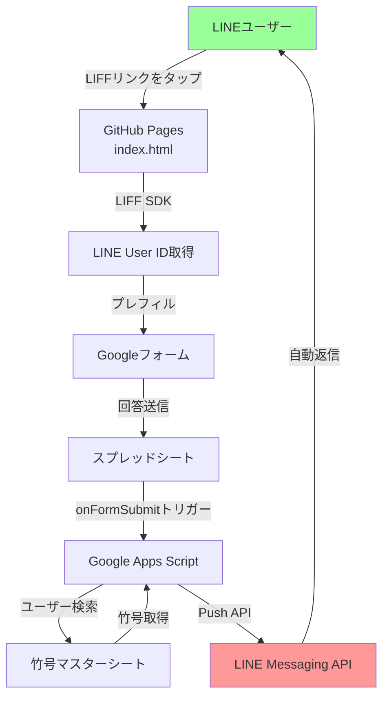
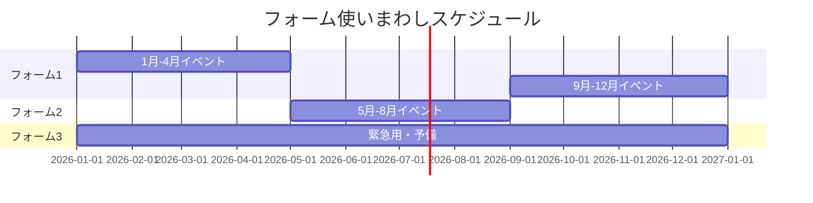

# LINE出欠確認システム 実装ウォークスルー

## 📋 プロジェクト概要

**目的**: LINEとGoogleフォームを連携させた出欠確認システムの構築

**主な機能**:
- LIFF経由でLINE User IDを自動取得
- User IDで竹号マスターを検索して竹号を特定
- フォーム回答後、LINEに自動返信メッセージを送信
- 複数フォーム対応

---

## 🔍 重要な発見：LINE API仕様変更

### 2025年頃の仕様変更

> [!WARNING]
> **LINE Messaging API Push メッセージの仕様変更**
> 
> 2025年頃にLINEの仕様が変更され、**友だち追加していないユーザーへのpushメッセージは送信できなくなりました**。
> 
> - **変更前（2024年11月まで）**: 友だち追加なしでもpushメッセージが送信できた（可能性あり）
> - **変更後（2025年以降）**: 友だち追加が**必須要件**

### 検証結果

| 条件 | 結果 |
|------|------|
| 友だち追加なし | ❌ メッセージは送信されるが届かない（APIは200を返す） |
| 友だち追加あり | ✅ メッセージが正常に届く |

### 技術的詳細

LINE APIの`/bot/message/push`エンドポイントは、友だち追加していないユーザーに対しても**HTTPステータス200（成功）を返します**。しかし実際にはメッセージは届きません。

```
Status Code: 200
Response Body: {"sentMessages":[{"id":"..."}]}
✓ Message sent successfully!
```

↑ このログが出ても、友だち追加していなければ**メッセージは届きません**。

---

## 🏗️ 実装アーキテクチャ

### システム構成



### ファイル構成

```
SyukketsuKakunin/
├── config.js          # 設定ファイル（トークン、シートID、メッセージテンプレート）
├── api.js             # メインロジック（フォーム処理、LINE送信、竹号照合）
├── main.js            # エントリーポイント（doPost, doGet）
├── index.html         # LIFF UI（GitHub Pagesで公開）
├── .clasp.json        # Google Apps Script設定
└── .gitignore         # Git除外設定
```

---

## 💡 実装の重要ポイント

### 1. Googleフォームのプレフィル

> [!IMPORTANT]
> Googleフォームで事前入力を機能させるには、**`usp=pp_url`** パラメータが必須です。

**正しいURL構築**:
```javascript
const redirectUrl = `${config.url}?usp=pp_url&${config.userIdEntry}=${encodeURIComponent(userId)}`;
```

**間違った例**（これでは動かない）:
```javascript
const redirectUrl = `${config.url}?${config.userIdEntry}=${encodeURIComponent(userId)}`;
```

### 2. 竹号マスターとの照合ロジック

3段階の検索で確実に照合：

1. **User IDで検索**（最速・最優先）
2. **竹号で検索**（フォームから送信された場合）
3. **LINE名で検索**（フォールバック）

[api.js:L84-L135](file:///G:/マイドライブ/ＬＩＮＥ公式アカウント/出欠確認処理/SyukketsuKakunin/api.js#L84-L135)

### 3. デバッグログの重要性

LINE API呼び出しでは、詳細なログ出力が問題解決の鍵：

```javascript
console.log('=== LINE API Request ===');
console.log('User ID:', userId);
console.log('Message:', text);
console.log('Status Code:', responseCode);
console.log('Response Body:', responseText);
```

[api.js:L140-L186](file:///G:/マイドライブ/ＬＩＮＥ公式アカウント/出欠確認処理/SyukketsuKakunin/api.js#L140-L186)

---

## 🎯 エルメッセージフォームの効果的な活用戦略

### エルメッセージの制限

- **無料プラン**: 最大3種類のフォームまで
- **デフォルトで自動返信機能あり**（独自実装不要）

### 📌 推奨：3つのフォームの使い分け戦略

#### パターン1: イベント種類別

| フォーム | 用途 | 更新頻度 | 備考 |
|---------|------|----------|------|
| フォーム1 | **定例会議**（毎月） | 低 | テンプレート化して使いまわし |
| フォーム2 | **臨時イベント** | 高 | 都度内容を変更 |
| フォーム3 | **アンケート・調査** | 中 | 汎用的な質問項目 |

#### パターン2: 期間別ローテーション



**メリット**:
- 同時期に複数フォームを使わない場合、過去のフォームを再利用できる
- 履歴データは別途スプレッドシートで管理

#### パターン3: テンプレート方式

**フォーム構成**:

```
【フォーム1: 出欠確認テンプレート】
├── イベント名（手動で都度変更）
├── 日時（手動で都度変更）  
├── 出欠（選択肢：固定）
└── コメント（テキスト：固定）

【フォーム2: アンケートテンプレート】
├── 質問1（都度変更）
├── 質問2（都度変更）
└── 自由記述（固定）

【フォーム3: 緊急連絡用】
├── 件名（都度変更）
└── 内容（都度変更）
```

**運用手順**:
1. イベントごとに該当フォームの設問を編集
2. LINEでフォームリンクを配信
3. 回答収集
4. 次のイベント時に同じフォームを再編集

> [!TIP]
> エルメッセージフォームは**編集しても回答データは保持される**ため、イベント終了後すぐに次のイベント用に編集しても過去データは消えません。

---

## 🔧 トラブルシューティング

### よくある問題と解決策

#### 1. メッセージが届かない

**症状**: API呼び出しは成功（Status 200）だが、メッセージが届かない

**チェック項目**:
- [ ] ユーザーがボットを友だち追加しているか
- [ ] チャネルアクセストークンが正しいか
- [ ] User IDが正しく取得できているか（ログで確認）

**解決策**:
```javascript
// ログでUser IDを確認
console.log('User ID:', userId);
console.log('User ID length:', userId.length); // 33文字であるべき
```

#### 2. User IDに不正な文字が含まれる

**症状**: User IDに `=` などの特殊文字が含まれている

**原因**: フォームの取得方法またはエンコーディングの問題

**解決策**:
- Googleフォームのentry番号を再確認
- `encodeURIComponent()` が正しく使われているか確認

#### 3. トリガーが動作しない

**症状**: フォーム送信してもスクリプトが実行されない

**解決策**:
1. Google Apps Scriptエディタで`setupTriggers()`を手動実行
2. トリガー一覧で正しく設定されているか確認

```javascript
function setupTriggers() {
  // 既存トリガー削除
  ScriptApp.getProjectTriggers().forEach(trigger => {
    if (trigger.getHandlerFunction() === 'onFormSubmit') {
      ScriptApp.deleteTrigger(trigger);
    }
  });
  
  // 新規トリガー作成
  CONFIG.FORMS.forEach(formConfig => {
    const ss = SpreadsheetApp.openById(formConfig.RESPONSE_SHEET_ID);
    ScriptApp.newTrigger('onFormSubmit')
      .forSpreadsheet(ss)
      .onFormSubmit()
      .create();
  });
}
```

---

## 📊 運用モード比較

### モード1: 友だち追加必須（完全自動化）

**メリット**:
- ✅ 回答後すぐに自動返信が届く
- ✅ ユーザーがリアルタイムで確認できる
- ✅ 竹号自動照合も機能

**デメリット**:
- ❌ メンバー全員に友だち追加を強制する必要がある
- ❌ 抵抗感があるメンバーもいる可能性

**推奨ケース**: 
- 新規グループ立ち上げ時
- メンバーが協力的な場合

---

### モード2: エルメッセージフォーム活用

**メリット**:
- ✅ 友だち追加不要
- ✅ デフォルトで自動返信機能あり
- ✅ 簡単セットアップ

**デメリット**:
- ❌ 無料枠は3フォームまで
- ❌ 竹号自動照合は別途実装が必要
- ❌ カスタマイズ性が低い

**推奨ケース**:
- 既存グループで友だち追加が難しい場合
- シンプルな出欠確認のみでよい場合

---

### モード3: スプレッドシート管理（手動確認）

**メリット**:
- ✅ 友だち追加不要
- ✅ 完全にカスタマイズ可能
- ✅ コスト不要

**デメリット**:
- ❌ 自動返信なし
- ❌ 管理者がスプレッドシートを確認する必要あり

**推奨ケース**:
- 自動返信が不要な場合
- データ管理を重視する場合

---

## 🎓 今回の教訓

### 1. LINE API仕様は変更される

> [!CAUTION]
> **LINE APIの仕様は予告なく変更される可能性があります。**
> 
> 以前動いていた仕組みが突然動かなくなることがあるため、定期的な動作確認が重要です。

### 2. 詳細なログ出力の重要性

問題解決には、以下の情報を必ずログに残す：
- リクエスト内容（User ID、メッセージ本文）
- レスポンス内容（ステータスコード、レスポンスボディ）
- エラーの詳細（スタックトレース含む）

### 3. 複数の代替手段を用意

1つの方法に依存せず、複数の選択肢を持つ：
- カスタム実装（Google Apps Script）
- エルメッセージフォーム
- スプレッドシート管理
- 友だち追加必須モード

---

## 📁 関連リソース

### 実装ファイル

- [config.js](file:///G:/マイドライブ/ＬＩＮＥ公式アカウント/出欠確認処理/SyukketsuKakunin/config.js) - 設定ファイル
- [api.js](file:///G:/マイドライブ/ＬＩＮＥ公式アカウント/出欠確認処理/SyukketsuKakunin/api.js) - コアロジック
- [index.html](file:///G:/マイドライブ/ＬＩＮＥ公式アカウント/出欠確認処理/SyukketsuKakunin/index.html) - LIFF UI

### 外部ドキュメント

- [LINE Developers](https://developers.line.biz/ja/)
- [LINE Messaging API ドキュメント](https://developers.line.biz/ja/docs/messaging-api/)
- [LIFF ドキュメント](https://developers.line.biz/ja/docs/liff/)

---

## ✅ 次のステップ

### 即座に実施できること

1. **エルメッセージフォーム3枠の使い分け計画を立てる**
   - 年間イベントカレンダーと照らし合わせて割り当て
   
2. **フォームテンプレート化**
   - よく使う質問項目をドキュメント化
   - コピペで素早くセットアップできるようにする

3. **定期的な動作確認**
   - 四半期に1回、テスト送信で確認
   - LINE API仕様変更のチェック

### 将来的な改善案

- **Webhookとreply APIの活用**: ユーザーがメッセージを送った際に返信する方式に変更
- **Google Apps Script以外のバックエンド**: Node.js + Cloud Functionsなど
- **有料プランの検討**: エルメッセージの有料プランでフォーム数を増やす

---

## 🙏 まとめ

今回の実装で、以下のことが明らかになりました：

1. ✅ **技術的には完璧に動作している**（友だち追加必須）
2. ✅ **LINE API仕様変更により、友だち追加が必須要件になった**
3. ✅ **エルメッセージフォームの方が運用上シンプル**

**推奨**: 現状では**エルメッセージフォーム3枠を効果的に使いまわす**運用が最も現実的です。

このドキュメントを保存しておくことで、同じ問題に再び遭遇した際に迅速に対応できます。
